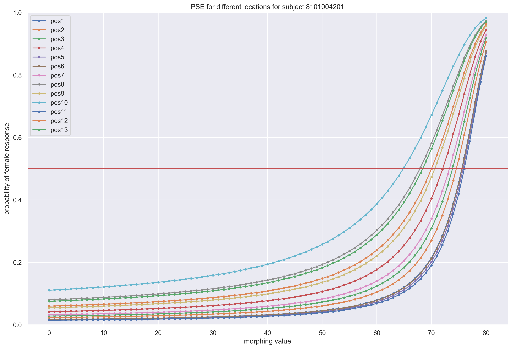
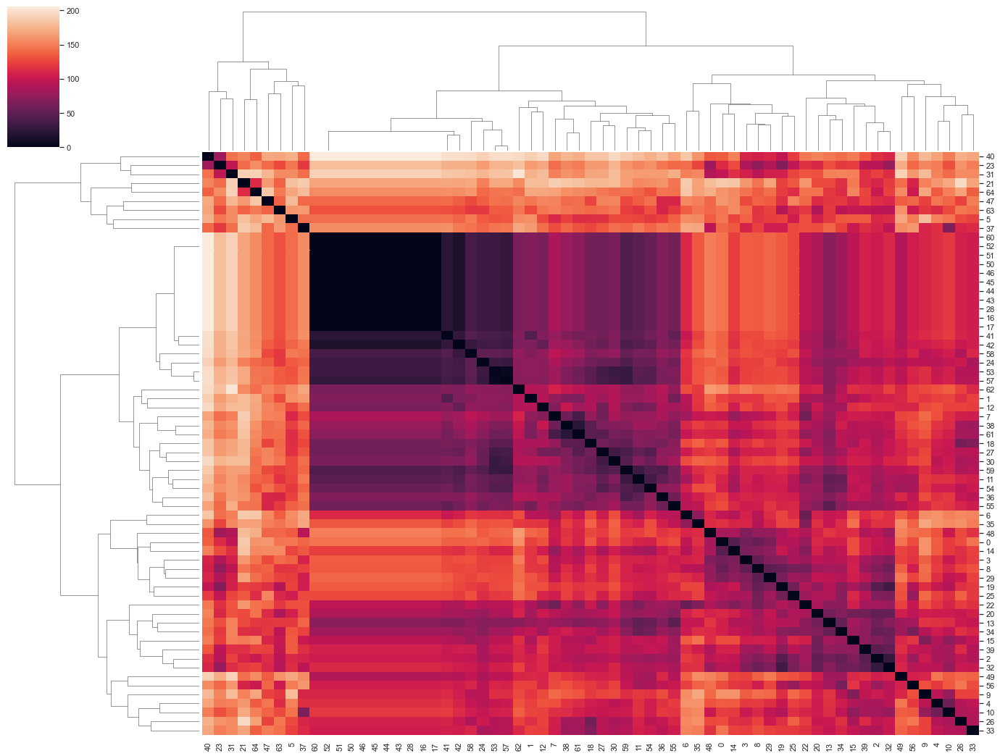

# Behavioral Analysis of subjects by designing a Psychopy task and analyzing the results

In this project, I've used the collected data from [Psychopy Task](https://github.com/amirhosein-mesbah/NeuroScience/tree/main/Psychopy), and several analyses have been done on this data.

## Cleaning the Data
- Correcting Column names
- scaling reaction times
- handling NaN values
- removing outliers

## Exploring the Data
- looking for correlation and relation of each pair of features

## Prediction of Behavioral Characteristics
- looking any relation between `reaction time` and other features
- looking any relation between `accuracy` and other features

## Psychometric Fitting
- fit psychometic functions for `location`, `visual field` and `Eccentricity` as a variable  
psychometic function for location of one of the subjects is shown below:  
  

## Spread of PSEs
- Statistical Test to check if PSEs for different `location`, `visual field` and `Eccentricity` are independent

## Reaction Time Correlation to Choice Complexity
- Check the relationship between `reaction time` and `handness` of each subject

## Representational Similarity Analysis (RSA)
- check similarity of PSEs for `location`, `visual field` and `Eccentricity` 
  
RSA for `location is shown below  
  

