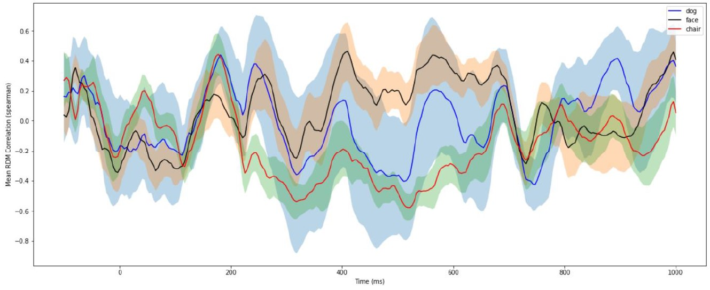
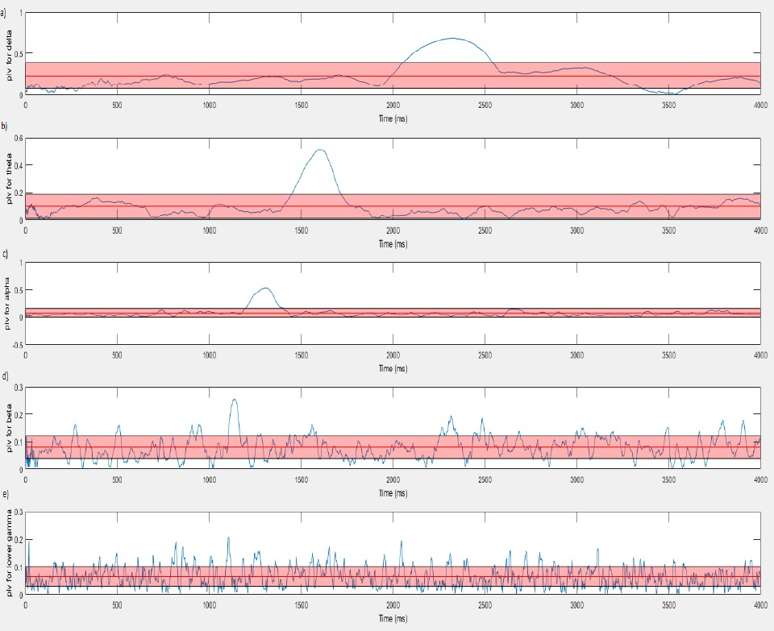

# Analysing Continuous‑Time Neural Signals for different data modalities

## Electroencephalogram
- EEgLab toolbox in Matlab
I've used EEgLab toolBox in Matlab for preprocessing EEG data:
  - Resampling
  - Re‑referencing
  - baseline normalization
  - creating epochs

- Representational Dissimilarity Matrices (RDM) Analysis
checking for the dissimilarity of brain state in the IT cortex for three different stimulus. RSA diagram is shown below  
  

  
As shown in the Figure above, at the time of 200 milliseconds, the graphs of all 3 stimuli overlap and these 3 stimuli cannot be distinguished from each other. So 200 milliseconds is not a good time to distinguish between 3 stimuli. According to the course materials and the class, cognition occurs in the IT cortex between 00 and 600 milliseconds. Therefore, according to the graph of this interval, it can be a good interval for distinguishing between 3 stimuli. Also, considering that the input image does not reach the IT cortex until 150 milliseconds, it can be seen in the diagram that from the beginning of time until about 150 milliseconds, the diagrams of the 3 stimuli overlap to a large extent.

## Local Field Potentials
- Phase Lock Analysis
In this part, we investigate phase locking between two areas of `v4` and `EFE` in the IT Cortex.  
  

  
In the delta, theta, and alpha ranges, we have phase lock in approximately 2300 milliseconds, 1650 milliseconds, and 1300 milliseconds respectively. According to Figure 13, which shows the memory-guided saccade task, these phase-locks can be related to the cue phase. That is, when showing the stimulus to the subject, the v4 and efe regions are phase-locked together.

- Grager Casualty
  - Checking for connectivity between `v4` and `ECE` 

## fMRI
- Seed‑based Correlation Analysis on fMRI data modality to find significant voxels
