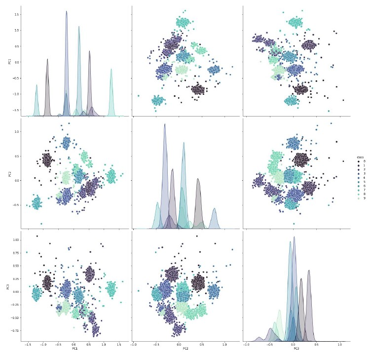
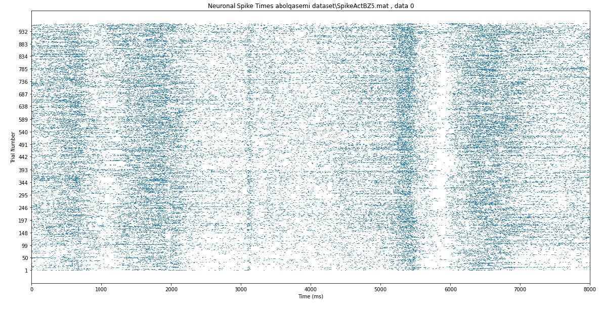
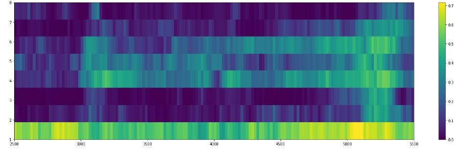

# Analysing Discrete‑Time Neural Signals

In this project, I've worked on Signle Cell data. Spike Sorting, Unit-based Decoding and Population-based decoding are the three tasks that have been done in this project.

## Spike Sorting
After Applying butterworth highpass filter on raw data, we need to calculate threshold for detecting peaks and after extracting peaks and applying PCA for Dimensionality Reduction we use K-Means algorithm for clustering.  
  
Below there is a PairPlot for K-means Algorithm for 9 proposed clusters  
  

## Unit-Based Decoding
- Raster Plots
- PSTH
- Firing Rate
- Mutual Information

A sample of `raster plot` is shown below  
  

  
According to this neuron, showing the stimulus to the subject and encoding it happens in approximately 3000 bases. According to the task, it has been pointed out that the encoding interval is between 3050 and 3200, and this indicates that the raster plot is correct for these neurons. In the same way, the approximate range of 5400 to 5600 is related to memory and the approximate range of 6500 to 6650 is also related to the saccade stage.

## Population-Based Decoding
- Use Machine Learning techniques like SVM to Predict and decode neurons performance.

The figure below shows recall for each angle over time with a window of 100 and stride  
  

