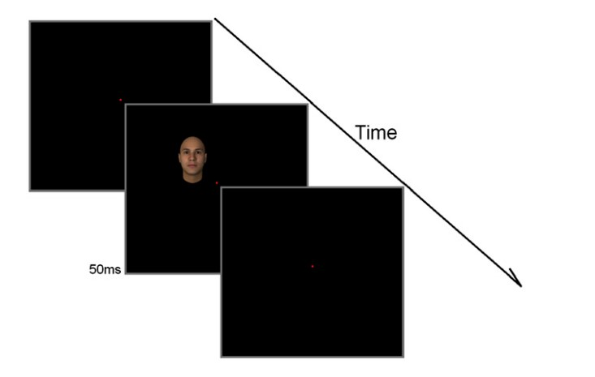

# Designing a Psychopy task
In this project, I've used psychopy to design a cognitive task and collect date to analyze. This task is Designed by Arash Afraz in the paper entitled "Spatial Heterogeneity in thePerception of Face and Form Attributes".
Timing Of task is Shown at below  
  

  
This Psychopy task is implemented to collect data due to a class assignment for `The Principles of cognitive science` course in spring 2020 at the University of Tehran. The dataset of each student is collected and after combining all of the datasets, we've applied behavioral analysis as the next assignment.
